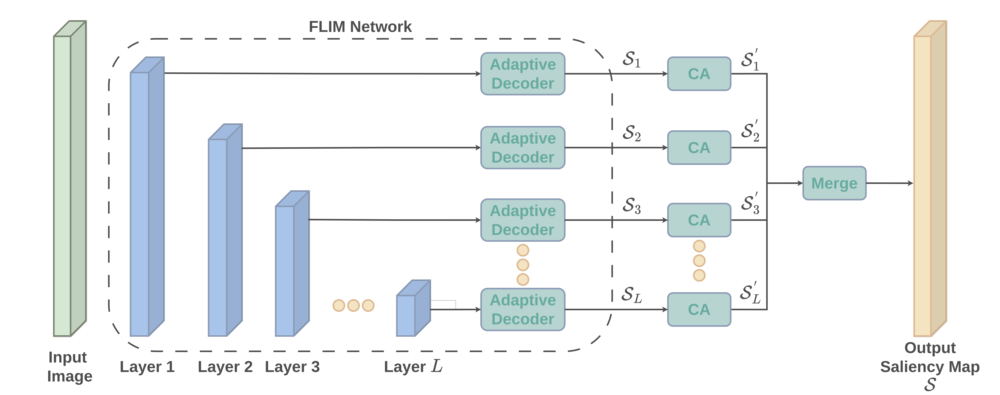

# Feature Learning from Image Markers meets Cellular Automata

This repository contains the source code and experimental materials for the Master's thesis **"Feature Learning from Image Markers meets Cellular Automata"** by Felipe Crispim da Rocha Salvagnini, supervised by Prof. Dr. Alexandre Xavier Falcão at the Institute of Computing, University of Campinas (UNICAMP).



<p align="center"><i>Figure 1: Multi-Level Cellular Automata for L-Layer FLIM networks.</i></p>

> This document aims to release the method developed during the Master's Degree of Felipe Crispim da Rocha Salvagnini, in a self-contained fashion, so one can validate it using our training images and employ it towards different problems.

> **DISCLAIMER:** Docker container uses CUDA. If you do not have a GPU, just use Cellular Automata and training/inference on CPU (for the merge model)

____

## Abstract

Deep learning approaches typically require extensive annotated datasets and increasingly complex network architectures. This paradigm presents significant challenges in resource-constrained environments, particularly for medical applications in developing countries where data annotation is costly and computational resources are limited. Additionally, many real-world problems, such as detecting Schistosoma mansoni eggs, involve fewer categories than general computer vision tasks, suggesting that simplified approaches may be viable. The Feature Learning from Image Markers (FLIM) methodology enables experts to design convolutional encoders directly from image patches, providing control over encoder complexity. Integrating an adaptive decoder with a FLIM encoder creates networks that eliminate the need for backpropagation and substantially reduce annotation requirements (typically to only 3-4 images). Combining FLIM networks with Cellular Automata (CA) creates a comprehensive pipeline for exploring object detection (or segmentation) on images. The CA works as a post-processing technique; moreover, FLIM facilitates the CA initialization, leveraging user knowledge without requiring per-image user interaction. Therefore, this MSc thesis aims to explore the integration of FLIM networks into the initialization of CA. We evaluate the FLIM-CA framework for salient object detection towards two challenging medical datasets: the detection of S. mansoni eggs in optical microscopy images and brain tumor detection in magnetic resonance imaging data. Our results demonstrate competitive performance compared to convolutional deep learning methods, with improvements of up to 13\% to 20\% on metrics such as F-Score and uWF, using only a fraction of the parameters (thousands vs. millions). Finally, we present a multi-level FLIM-CA to explore the convolutional encoder's hierarchical representation at each level, where intermediary saliency maps initialize corresponding CAs, and the outputs of CAs are merged into a final, improved saliency map. Our work proposes a multi-level FLIM-CA system that builds upon the hierarchical capabilities of FLIM encoders.

____

## Organization

```bash
FLIM_MCA/
├── docker/                      # Docker configuration files for containerized execution
├── miscellaneous/               # Supplementary materials and datasets
│   ├── brain_tumor/             # Brain tumor detection (FLIM files and sample images)
│   ├── images/                  # Documentation images and figures
│   └── parasites/               # Schistosoma mansoni egg detection (FLIM files and sample images)
├── src/                         # Source code organized by pipeline stages
│   ├── 1_flim_design/           # 1: FLIM encoder design
│   ├── 2_feature_extraction/    # 2: Extract features through FLIM Convolutional Encoder
│   ├── 3_decoding/              # 3: Decodes extracted features, characterizing a FLIM network
│   ├── 4_cellular_automata/     # 4: Cellular automata initialization and evolution algorithms
│   └── 5_saliency_fusion/       # 5: Multi-level saliency map fusion and final output generation
├── .gitignore                   # Git ignore configuration
├── LICENSE                      # Project license
└── README.md                    # Project documentation (this file)
```

> **Datasets DISCLAIMER:** This repository releases only the minimal training images necessary to design a FLIM Encoder, run multi-level CAs, and train/test the network that merges multi-level saliencies into a unified version.

> **Parasites Dataset:** Our experiments use a private parasite egg dataset developed in our laboratory, recently made available at [https://github.com/LIDS-Datasets/schistossoma-eggs](https://github.com/LIDS-Datasets/schistossoma-eggs). Training images (with markers) and validation splits are organized in `trainN.csv` files, where N represents the split number (1-3). Test images are listed in `testN.csv` files.

> **BraTS Dataset:** We use the BraTS 2021 dataset for brain tumor experiments. Access to the complete BraTS dataset requires registration and agreement to the challenge terms at the [official BraTS website](https://www.synapse.org/Synapse:syn51156910/wiki/622351). Our repository includes only the minimal training subset used for FLIM encoder design, following the same split structure (`trainN.csv`/`testN.csv`). Following the files, one can process the 3D dataset to generate our 2D dataset, where each file name is structured as: `BraTS2021_00014_a1_s0051.png`, where `sXXXX` indicates the axial slice.

> **Note:** Due to the FLIM methodology's requirement of only 3-4 training images per dataset, the released training subsets are sufficient to reproduce our FLIM encoder design process and validate our multi-level CA approach. After the initial learning, the reader is ready to evaluate the proposed pipeline on different problems.

## Final Recommendations

As visualized in **Figure 1**, our method is composed of multiple steps, which we organized in the `src` folder. A README provides further details and guidelines for execution inside each step folder:

1. [FLIM design phase: Designing a FLIM Convolutional Encoder](src/1_flim_design/README.md)
2. [FLIM feature extraction: Extract features using the learned FLIM Convolutional Encoder](src/2_feature_extraction/README.md)
3. [FLIM feature decodification: Adaptively Decode a saliency map from FLIM's extracted features](src/3_decoding/README.md)
4. [FLIM CA Integration: Initialize multiple CAs and evolve them until convergence](src/4_cellular_automata/README.md)
5. [Saliency Fusion: Train a straightforward network to merge multi-level saliency maps into a better unified saliency map](src/5_saliency_fusion/README.md)

> Despite working with FLIM Network Saliency Maps (FLIM Encoder + Adaptive Decoder), the proposed pipeline may be evaluated on different approaches with multi-level saliency maps. We are investigating adapting our pipeline towards deep-learning methods when few training images are available, which is a limitation currently.

> We employ the libift (Image Foresting Transform Library) released at (`lib_flim_mca/`) compiled for CPU (`lib_cpu.tar.gz`) or GPU (`lib_gpu.tar.gz`). If you want to explore the Feature Learning From Image Markers methodology to design convolutional encoders, we strongly recommend that you examine the repository from our laboratory: [FLIM-Python](https://github.com/LIDS-UNICAMP/flim-python-demo).

## Quick Start

1. Clone the repository
2. If necessary, install Docker and Docker Compose. To get the most out of our method, please test it using a computer with a GPU.
   1. Generate the .env file: `./setup_script.sh`
   2. Build the Docker image: `docker-compose build`
   3. Start the container: `docker-compose up -d`
   4. Attach to the container: `docker exec -it flim_mca /bin/bash`
3. Follow the step-by-step pipeline in the `src/` folder
4. Start with [FLIM design phase](src/1_flim_design/README.md)

> **Expected workflow:** Design → Extract → Decode → CA Evolution → Fusion

## Citation

If you use this work in your research, please cite our papers:

**ArXiv Preprint:**

```bibtex
@misc{salvagnini2025multilevelcellularautomataflim,
      title={Multi-level Cellular Automata for FLIM networks},
      author={Felipe Crispim Salvagnini and Jancarlo F. Gomes and Cid A. N. Santos and Silvio Jamil F. Guimarães and Alexandre X. Falcão},
      year={2025},
      eprint={2504.11406},
      archivePrefix={arXiv},
      primaryClass={cs.CV},
      url={https://arxiv.org/abs/2504.11406},
}
```

**SIBGRAPI 2024 Conference:**

```bibtex
@INPROCEEDINGS{10716266,
  author={Salvagnini, Felipe Crispim R. and Gomes, Jancarlo F. and Santos, Cid A. N. and Guimarães, Silvio Jamil F. and Falcão, Alexandre X.},
  booktitle={2024 37th SIBGRAPI Conference on Graphics, Patterns and Images (SIBGRAPI)},
  title={Improving FLIM-Based Salient Object Detection Networks with Cellular Automata},
  year={2024},
  pages={1-6},
  keywords={Representation learning;Graphics;Microprocessors;Computational modeling;Automata;Object detection;Computer architecture;Network architecture;Decoding;Complexity theory},
  doi={10.1109/SIBGRAPI62404.2024.10716266}}

```