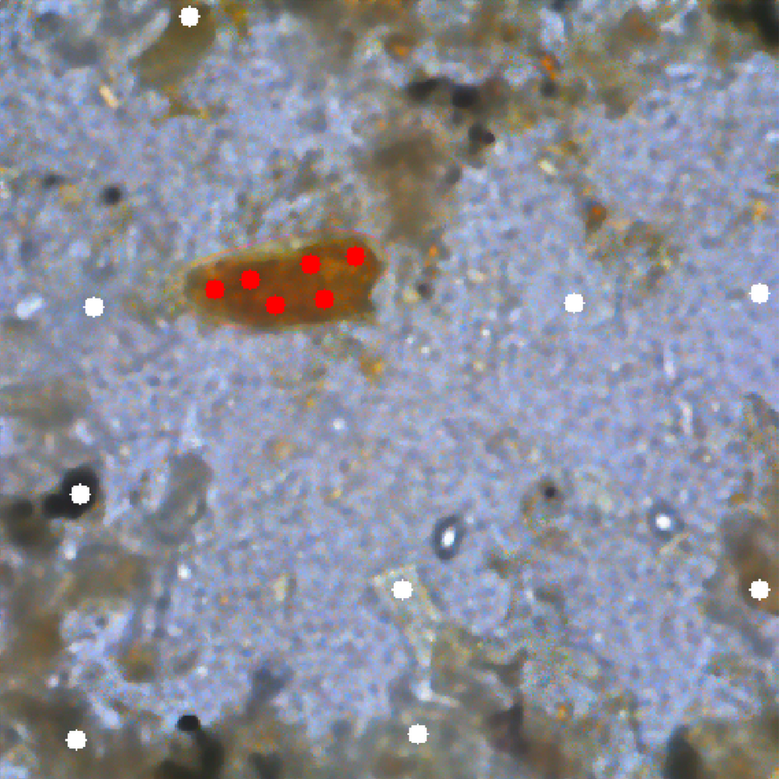
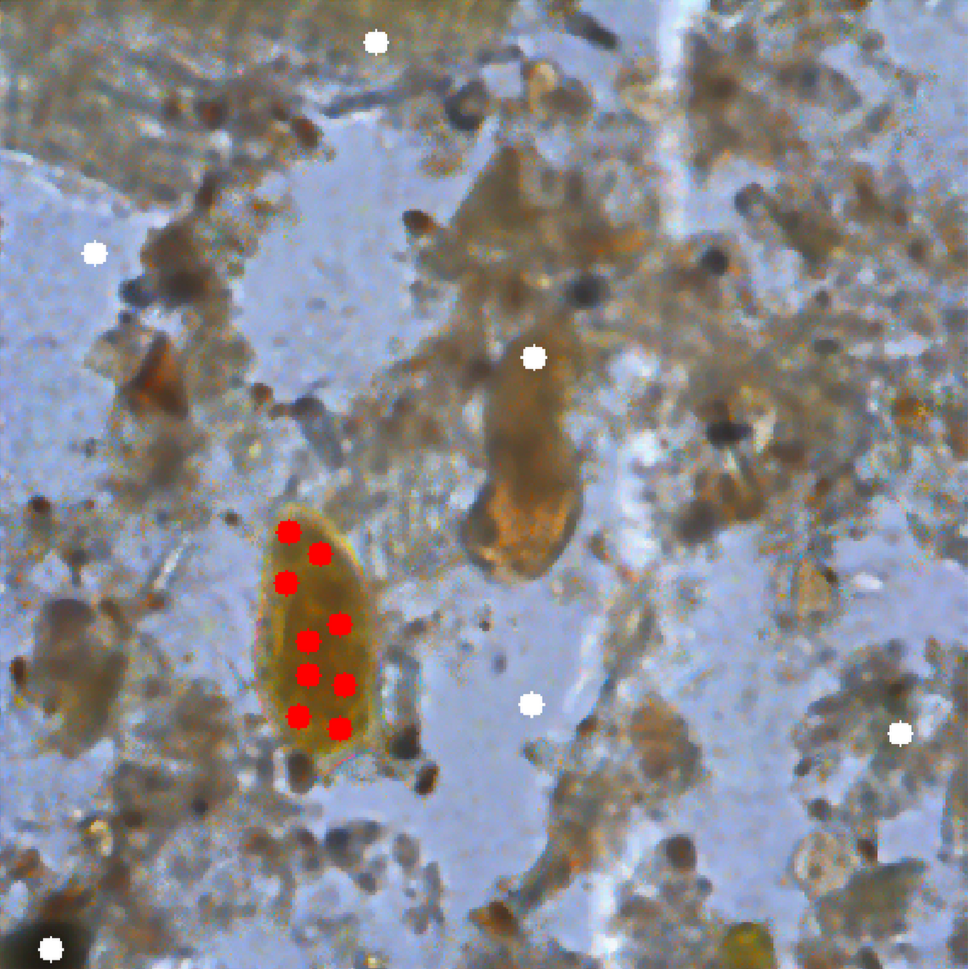
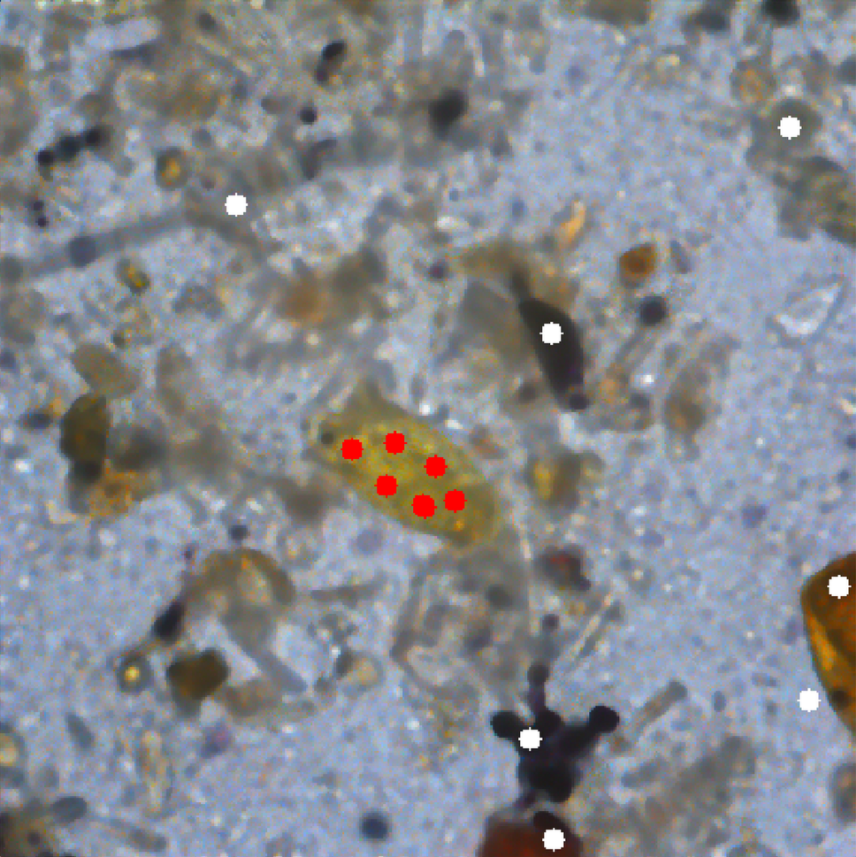

# FLIM design phase: Designing a FLIM Convolutional Encoder

As the first step of our pipeline, we must learn the FLIM encoder. Follow the two steps below:

1. Compile the iftFLIM-LearnModel.c code `./compile.sh 1` for GPU support or `./compile.sh 0` for CPU;
2. Generate the FLIM-Encoder, using the sample training images. Run the `train_flim_encoders.sh` script:

```bash
# For parasite samples
./train_flim_encoders.sh /workdir/miscellaneous/parasites/
# For brain samples
./train_flim_encoders.sh /workdir/miscellaneous/brain_tumor/
```

The script calls the iftFLIM-LearnModel executable, with the following arguments:

1. The FLIM encoder architecture (specified through a json file);
2. The folder with the input images (e.g., colored or gray-scale images of our problem);
3. Seeds file containing user-drawn marker coordinates for each training image. These markers identify descriptive and discriminative regions that guide the convolutional filter learning process;
4. Output folder, where the weights of the FLIM convolutional encoder will be saved:
   - For parasite eggs: `/workdir/out/parasites/splitN/flim_model/`
   - For brain tumors: `/workdir/out/brain_tumor/splitN/flim_model/`
   
 Where `N` represents the split number (e.g., split0, split1, split2).

> Models are learned for each split.

**Note:** The FLIM encoder design follows an iterative training procedure. Starting with one image, performance is evaluated on validation data, and poorly performing images are progressively added to the training set until satisfactory performance is achieved (typically 3-4 images). **For the sake of conciseness, we added the final defined training images.**

> In the remainder of this file, we will provide an overview of each component of the FLIM methodology. For comprehensive theoretical details, please refer to our MSc thesis documentation.

## Json Architecture

Below we have an example of a Json specifying a FLIM encoder architecture (for parasites):

```json
{
  "stdev_factor": 0.010000,
  "nlayers": 4,
  "apply_intrinsic_atrous": false,
  "layer1": {
    "conv": {
      "kernel_size": [3, 3, 0],
      "nkernels_per_marker": 3,
      "dilation_rate": [1, 1, 0],
      "nkernels_per_image": 10000,
      "noutput_channels": 200
 },
    "relu": true,
    "pooling": {
      "type": "avg_pool",
      "size": [3, 3, 0],
      "stride": 2
 }
 },
  "layer2": {
    "conv": {
      "kernel_size": [3, 3, 0],
      "nkernels_per_marker": 3,
      "dilation_rate": [1, 1, 0],
      "nkernels_per_image": 10000,
      "noutput_channels": 200
 },
    "relu": true,
    "pooling": {
      "type": "avg_pool",
      "size": [3, 3, 0],
      "stride": 2
 }
 },
  "layer3": {
    "conv": {
      "kernel_size": [3, 3, 0],
      "nkernels_per_marker": 3,
      "dilation_rate": [1, 1, 0],
      "nkernels_per_image": 10000,
      "noutput_channels": 200
 },
    "relu": true,
    "pooling": {
      "type": "avg_pool",
      "size": [3, 3, 0],
      "stride": 1
 }
 },
  "layer4": {
    "conv": {
      "kernel_size": [3, 3, 0],
      "nkernels_per_marker": 3,
      "dilation_rate": [1, 1, 0],
      "nkernels_per_image": 10000,
      "noutput_channels": 200
 },
    "relu": true,
    "pooling": {
      "type": "avg_pool",
      "size": [3, 3, 0],
      "stride": 1
 }
 }
}
```

### Global Parameters

- `stdev_factor`: Numerical stability parameter ($\epsilon$) added to standard deviation during marker-based normalization to prevent division by zero when marked regions have low variance
- `nlayers`: Number of convolutional blocks, each containing a filter bank + pooling operation
- `apply_intrinsic_atrous`: Enables automatic dilation rate adjustment based on pooling stride to maintain receptive field consistency across layers

### Layer-Specific Parameters

Each layer (`layer1`, `layer2`, etc.) contains:

**Convolution (`conv`):**
- `kernel_size`: Filter dimensions [height, width, depth] where depth=0 for 2D convolutions;
- `nkernels_per_marker`: Number of filters generated from each user-drawn marker;
- `dilation_rate`: Spacing/dilation between kernel elements [height, width, depth];
- `nkernels_per_image`: Maximum filters allowed per training image (upper bound to prevent excessive filter generation);
- `noutput_channels`: Maximum output channels per layer. Filter reduction via K-means clustering occurs when learned kernels exceed this value; otherwise, no reduction is applied.

**Activation & Pooling:**
- `relu`: Boolean flag to apply ReLU activation function or not;
- `pooling.type`: Pooling operation (`avg_pool` for parasites, `max_pool` for brain tumors);
- `pooling.size`: Pooling window dimensions [height, width, depth];
- `pooling.stride`: Step size affecting spatial resolution (typically 2 for early layers, 1 for deeper layers).

> **Note**: The JSON specifies maximum parameter bounds. Actual filter counts depend on the number of markers placed during training and may be significantly lower than the specified maximums. We purposely selected larger values to increase control over filter estimation and avoid unwanted filter reduction.

## Seeds File

For each image, in the training data, we have an associated markers file, in the markers folder, following the name pattern: `<image_name>-seeds.txt`. The seeds.txt file is organized as follows:

```txt
<N_markers> <Image_width> <Image_height>
x_coordinate  y_coordinate  marker_id   label   handicap
x_coordinate  y_coordinate  marker_id   label   handicap
[...]         [...]         [...]       [...]   [...]
x_coordinate  y_coordinate  marker_id   label   handicap
```

- **Header line:** Contains the total number of markers, image width, and image height
- **Data lines:** Each subsequent line represents one marker with five fields:
  - **x_coordinate**: Horizontal pixel position of the marker
  - **y_coordinate**: Vertical pixel position of the marker
  - **marker_id**: Unique identifier for the marker (default -1 for all markers). During FLIM execution, we employ adjacency relationships to group marked pixels from the same markers.
  - **label**: Class label associated with the marker (e.g., 0 for background, 1 for foreground)
  - **handicap**: Additional parameter for marker weighting (implementation-specific)

In this work, we employ only the spatial coordinates (x_coordinate, y_coordinate) from each marked pixel. These coordinates define the center positions for patch extraction during the FLIM encoder training process. The extracted patches from these locations are used for:

- **Marker-based image normalization (MBIN)**: Computing mean and standard deviation statistics
- **Filter learning**: Clustering normalized patches to generate convolutional filters
- **Feature extraction**: Defining discriminative regions for filter estimation

## Overview of FLIM Methodology

Once we have the FLIM architecture configuration and seed files, we can read training images and employ the following FLIM methodology to learn our convolutional encoder. We summarize the complete process as follows:

## 1. Data Preparation:

- Read input data (input images, or extracted features from previous layers)
- Read seeds and extract marker labels from the seeds files
- Compute marker-based normalization parameters (mean ($\mu$) and standard deviation ($\sigma$) for each channel) from all marked pixels across training images

## 2. Filter Extraction Process

- Define spatial relationships based on kernel sizes (width and height) to determine patch neighborhoods
- Normalize all training images using learned MBIN parameters before patch extraction
- Extract patches from normalized images at each marked pixel location according to the defined neighborhood

## 3. Hierarchical Filter Learning

The following three-level process is executed:

**Level 1 - Per marker:**

- Extract the patch dataset from each marker's pixels
- Apply K-means clustering with `K = nkernels_per_marker` to generate filters
- Enforce unit norm constraint: $||K^i|| = 1$ for all learned filters

**Level 2 - Per image:**

- Combine all filters learned from markers within the same image
- If total filters exceed `nkernels_per_image`, perform K-means reduction with `K = nkernels_per_image`

 **Level 3 - Across all Training:**

- Aggregate filters from all training images
- If total filters exceed `noutput_channels`, perform final K-means reduction with `K = noutput_channels`

## 4. Multi-Layer Extension

- Feature extraction using learned filters for the current layer
- Project markers to feature space for subsequent layers
- Repeat process for deeper layers using extracted features as input


> Note: Filter reduction occurs at three hierarchical levels to maintain user control while ensuring computational efficiency. At each level, K-means clustering with Euclidean distance is used when the number of filters exceeds the specified thresholds.

_____

Lastly, let us take as an example split1 for parasites (which has the JSON configuration above) to understand the learning process further. The three figures below show the markers for our training images:

| Image 1 | Image 2 | Image 3 |
|:---------------------:|:---------------------:|:---------------------:|
|  |  |  |
| 000479.png | 000675.png | 000917.png |

On the first image (`000479.png`), we have 15 markers, on the second one (`000675.png`), we also have 15 markers, and lastly, on the third image (`000917.png`), we have 13 markers. Considering three kernels per marker (`nkernels_per_marker": 3`), we have the following number of learned filters for each image:

- `000479.png`: 45
- `000675.png`: 45
- `000917.png`: 39

For none of the images does the number of learned filters exceed the maximum (`nkernels_per_image` = 10000), so no reduction is performed at the image level.

Combining all learned filters, we have 129 kernels total (45 + 45 + 39), which does not exceed the `noutput_channels` limit (200), so again, no reduction is performed at the layer level.

Once this procedure is fully executed, in the case of the first split for parasite eggs, we have a 4-layer FLIM encoder with 129 kernels at each layer level. For training or inference images, we can now extract feature maps and later decode them, which is the subject of the following stages. Please move to [FLIM feature extraction: Extract features using the learned FLIM Convolutional Encoder](../2_feature_extraction/README.md).